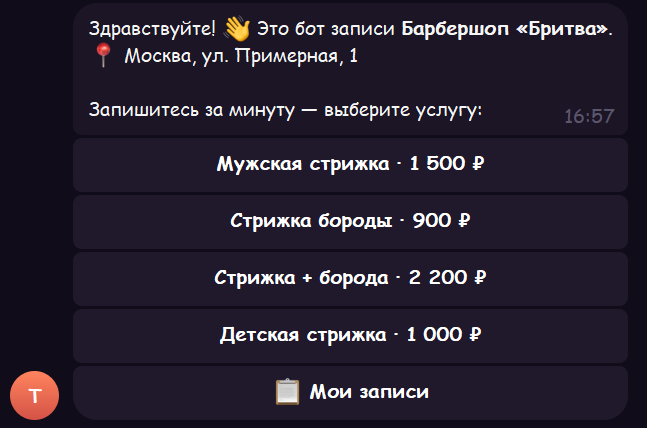
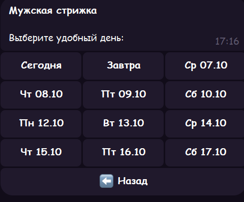
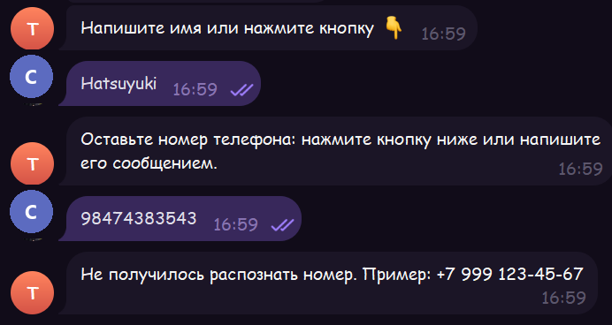
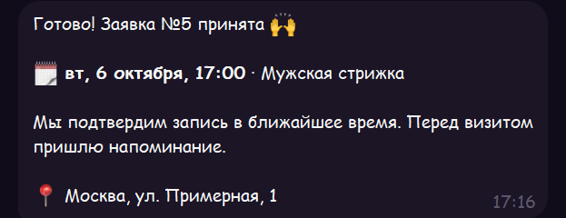
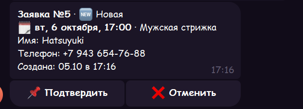
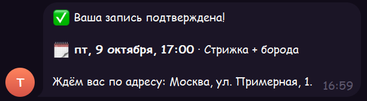
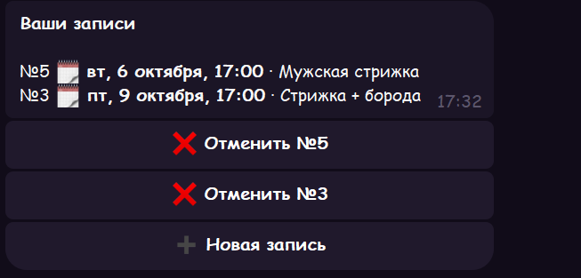
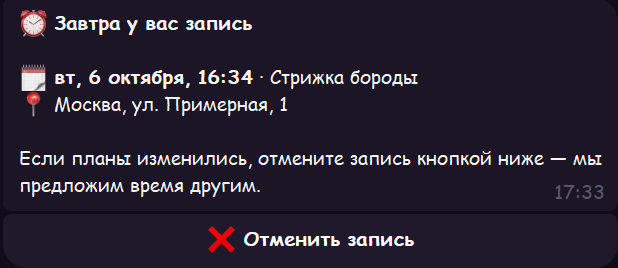
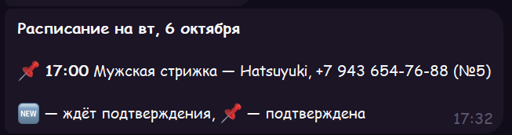

# Telegram-бот для записи клиентов

[](https://github.com/ZniKDK/tg-lead-bot/actions/workflows/tests.yml)


Клиент выбирает услугу, день и свободное время, оставляет имя и телефон. Администратор получает карточку заявки и подтверждает её одной кнопкой, а клиенту приходит ответ. За сутки и за пару часов до визита бот напоминает клиенту о записи. Если планы изменились, клиент отменяет запись сам, и время освобождается для других.

Бот подойдёт барбершопу, салону, автосервису, мастерской, репетитору или клинике: всем, к кому записываются на время. Услуги, цены, график с перерывами и праздники владелец меняет в одном файле `config.toml`, код трогать не нужно.

## Как это выглядит

| Клиент выбирает услугу | …и день |
|---|---|
|  |  |

Бот проверяет телефон и подсказывает формат:



| Клиент получает подтверждение | Админ получает карточку заявки |
|---|---|
|  |  |

| Админ подтвердил, клиенту пришёл ответ | Клиент видит и отменяет свои записи |
|---|---|
|  |  |

За сутки и за 2 часа до визита бот напоминает о записи:



Расписание дня для администратора, команда `/tomorrow`:



## Возможности

**Клиенту**
- запись за пару нажатий: услуга (с ценой) → день → время → имя → телефон;
- бот показывает только дни и время, где есть свободные окна; занятое и прошедшее время скрыто;
- имя подставляется кнопкой из профиля Telegram, телефон отправляется кнопкой «Отправить номер»;
- постоянному клиенту не нужно вводить данные заново: бот берёт их из прошлой записи;
- напоминание за сутки и за 2 часа до визита с кнопкой «Отменить запись»;
- `/my` показывает предстоящие записи, любую из них можно отменить;
- бот отвечает на любое сообщение и подсказывает, что делать дальше.

**Администратору**
- карточка новой заявки с кнопками «Подтвердить» и «Отменить»; клиент сразу узнаёт о решении;
- уведомление, если клиент отменил запись сам;
- `/today` и `/tomorrow` выводят расписание дня по времени, с именами и телефонами;
- `/new` показывает неподтверждённые заявки, `/leads` — последние 10;
- `/export` присылает все заявки в CSV, файл открывается в Excel без настройки кодировки;
- у админов своё меню команд, клиенты его не видят.

**Надёжность**
- одно время нельзя занять дважды: защиту держит база данных, даже если два клиента нажали кнопку одновременно;
- бот считает время в часовом поясе бизнеса, поэтому сервер в UTC не сдвинет запись на 3 часа;
- клиент не может отменить чужую запись или отменить свою позже, чем за 2 часа до визита (срок настраивается);
- лимит активных записей на одного клиента защищает график от «бронирования про запас»;
- при ошибке в настройках бот пишет, что именно исправить, вместо трассировки Python;
- база от прошлой версии обновляется сама при запуске, заявки сохраняются.

## Стек

Python 3.11+ · aiogram 3 · SQLite (aiosqlite) · pytest · ruff · Docker · GitHub Actions

## Быстрый старт

1. Создайте бота у [@BotFather](https://t.me/BotFather) и получите токен.
2. Узнайте свой Telegram ID у [@userinfobot](https://t.me/userinfobot).
3. Установите и запустите (Windows, PowerShell):

```powershell
git clone https://github.com/ZniKDK/tg-lead-bot.git
cd tg-lead-bot
python -m venv .venv
.venv\Scripts\activate
pip install -r requirements.txt
copy .env.example .env                  # впишите BOT_TOKEN и ADMIN_IDS
copy config.example.toml config.toml    # услуги, график, адрес
python -m bot.main
```

На Linux вместо `.venv\Scripts\activate` пишите `source .venv/bin/activate`, вместо `copy` — `cp`.

### Запуск на сервере через Docker

```bash
cp .env.example .env
cp config.example.toml config.toml
docker compose up -d --build
```

База лежит в папке `data/` на сервере и переживает перезапуск контейнера. После сбоя или перезагрузки сервера Docker поднимет бота сам. Внутри контейнера бот работает от обычного пользователя, а не от root.

## Настройки

### `.env`: секреты

| Переменная | Что задаёт | Пример |
|---|---|---|
| `BOT_TOKEN` | токен бота | `123456:ABC...` |
| `ADMIN_IDS` | ID администраторов через запятую. Каждый админ должен один раз нажать /start в боте | `111111111,222222222` |
| `DB_PATH` | путь к базе (необязательно) | `data/leads.db` |
| `CONFIG_PATH` | путь к файлу настроек (необязательно) | `config.toml` |

### `config.toml`: всё о бизнесе

```toml
[business]
name = "Барбершоп «Бритва»"
address = "Москва, ул. Примерная, 1"
phone = "+7 999 000-00-00"
timezone = "Europe/Moscow"

[[services]]
name = "Мужская стрижка"
price = "1 500 ₽"

[schedule]                        # день не указан — выходной
mon = "10:00-14:00, 15:00-20:00"  # перерыв на обед через запятую
sat = "11:00-18:00"

[booking]
slot_minutes = 60
days_ahead = 14
min_minutes_before = 60           # нельзя записаться ближе, чем за час
max_active_per_user = 2
cancel_hours_before = 2
holidays = ["2026-12-31", "2027-01-01"]

[reminders]
day_before = true
hours_before = 2                  # 0 — без второго напоминания
```

Полный образец с комментариями лежит в [`config.example.toml`](config.example.toml).

## Структура

```
bot/
├── main.py          # запуск, меню команд, фоновые напоминания
├── config.py        # чтение .env и config.toml с проверкой ошибок
├── db.py            # SQLite: заявки, статусы, обновление старой базы
├── utils.py         # телефон, свободное время, напоминания, CSV; без Telegram
├── reminders.py     # отправка напоминаний раз в минуту
├── keyboards.py     # кнопки
├── texts.py         # все тексты сообщений в одном месте
└── handlers/
    ├── client.py    # запись (FSM) и «Мои записи»
    └── admin.py     # команды и кнопки администратора
tests/               # 68 тестов: настройки, утилиты, база, сквозные сценарии
```

## Тесты

```powershell
pip install -r requirements-dev.txt
ruff check .
pytest
```

Сквозные тесты в `tests/test_flow.py` проходят весь диалог клиента, отмену записи, действия админа и напоминания без настоящего Telegram: запросы к API перехватывает фейковая сессия. GitHub Actions гоняет линтер и тесты на Python 3.11, 3.12 и 3.13 при каждом пуше.

## Что можно добавить под заказчика

- выбор мастера или филиала со своим графиком;
- услуги разной длительности (стрижка — час, окрашивание — три);
- выгрузка заявок в Google Таблицы или CRM (amoCRM, Битрикс24);
- предоплата через ЮKassa;
- веб-админка вместо команд в чате.

## Лицензия

MIT
